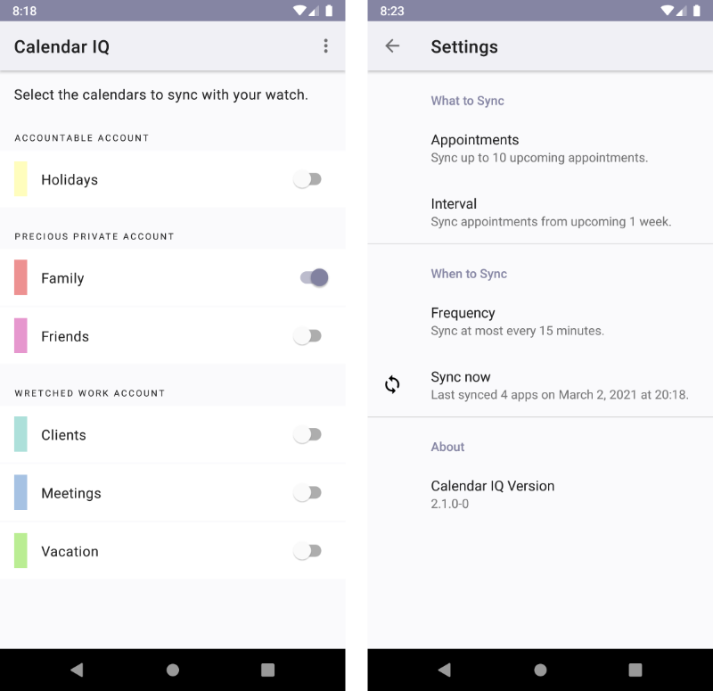

# Calendar IQ Connector

This Android app sends calendar events to compatible (and registered) apps on Garmin smartwatches. It is a companion app to [Facey McWatchface](https://github.com/le-cds/connectiq-faceymcwatchface), my own watchface.

It looks something like this:

## Installation

The app is available [at the Google Play Store](https://play.google.com/store/apps/details?id=net.hypotenubel.calendariq).

## For Developers

Feel free to open issues and submit pull requests.

If you’re developing your own watchface and want to have this app send calendar information to your watchface as well, simply open an issue with the UUID of your watchface.